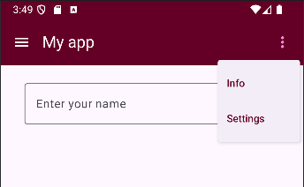
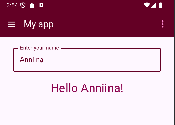
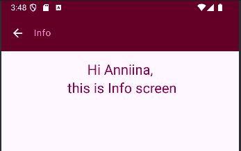
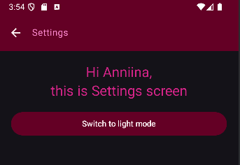

## Scaffold and navigation 

This is simple 3-screen Android app, that demonstrates navigation and scaffold components. 
App demonstrates also state hoisting and shared state between screens (name input and dark mode toggle).
Implemented with **Kotlin** + **Jetpack Compose**.


### Screenshots

<table>
    <tr>
        <td></td>
        <td></td>
    </tr>
    <tr>
        <td></td>
        <td></td>
    </tr>
</table>

### Features

- Main screen with text input for entering a name
- Greeting message displayed dynamically when name is entered
- Info screen with title displaying the shared name value
- Settings screen with title and button for dark/light theme toggle
- Top app bar with navigation between screens
- Shared state for name and theme mode accessible on all screens

### Implementation details
- `Scaffold` layout structure 
- `TopAppBar` composables used for navigation: 
  - MainTopBar displays submenu (`DropdownMenu, DropdownMenuItem`) for navigating to other screens using `MoreVert` and `Menu` `IconButton`s 
  - ScreenTopBar provides back-navigation to main screen with `ArrowBack IconButton`
- Navigation handled in ScaffoldApp using `Navigation Compose` with `NavHost` and `NavController`
- Three `composable screens` as `routes`:
  - "home" (MainScreen)
  - "info" (InfoScreen)
  - "settings" (SettingsScreen)
- OutlinedTextField component for name input
- State variables and callback functions are defined at top level (in MainActivity) and passed down to child composables as parameters (state hoisting)
- Styling implemented using modifiers and Material3

### Running the app

This project was created using **Android Studio**.
To clone and open the project:

```bash
- git clone https://github.com/Anniina-55/Scaffold-and-navigation.git
- cd scaffold_and_navigation

- open and run the project in Android Studio
-> UI should render on emulator and connected physical devices

